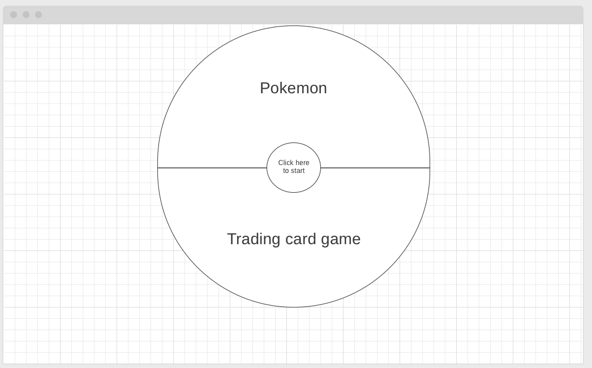
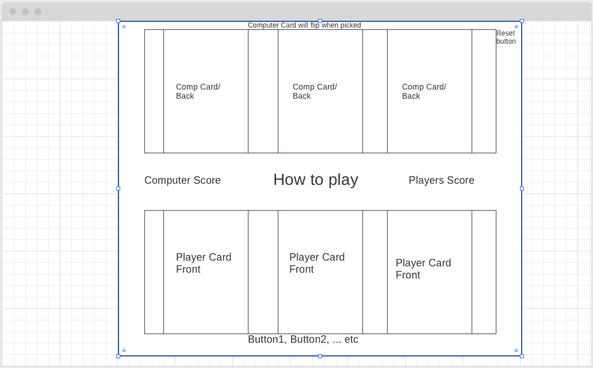
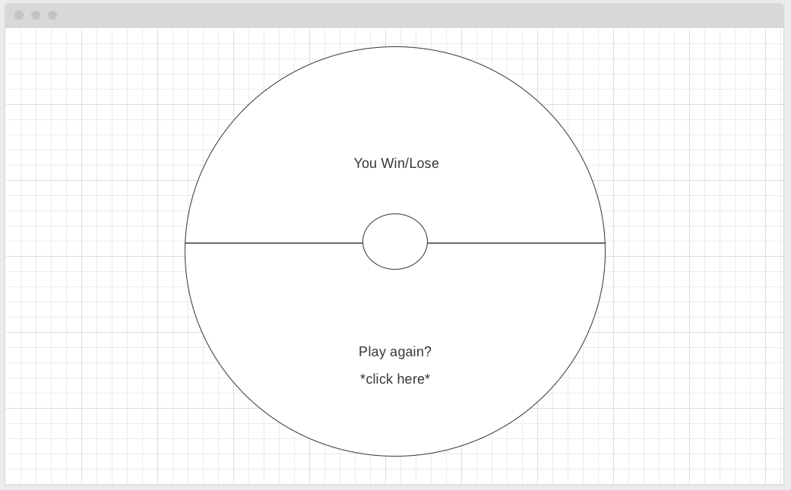

# Pokemon Trading Card Game jQuerey Edition

## Index:

- [Scope](#Scope)
- [User stories](#user-stories)
- [Wireframes](#wireframes)

## Scope

The goal is to develop a game w/javascript and plable in the browser.

## User Stories
The Player can have fun playing Pokemon Trading card game with a computer opponent

---
### Pages that can be viewed

- View the starting Page
- View the game board Page
- View the Winners/Looser Page

### Actions on the Game Board

- start the game
- pic a card to play
- start the battle
- reset the game

### Action on Winner/Looser Page

- Restart the game

## Wireframes

### Landing

User will see a Pokeball in the middle of the screen with a start game button

### Game Board

This is the Game Board

### Winners/Loser Screen

The user will be redirected to this screen 
to see if they won or lost.

